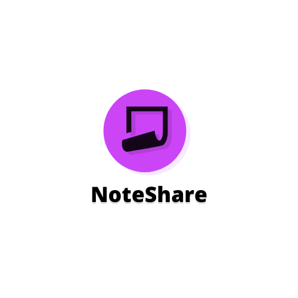

# NoteShare 

# Welcome to NoteShare 

## Table of contents
* [What is it](#what-is-it?)
* [Features](#features)
* [Technologies](#technologies)
* [Plans](#plans)

--- 

## What is it?
Noteshare is a web-app made with Python web framework - Django.

Currently it's mainly focused on sharing and downloading school notes.

---

## Features:
- Sharing your school notes to others
- Finding and downloading school notes made by others
- Adding friends
- Login with Facebook

---

## Technologies:
- Python 3.9
- Django 3.2
- PostgreSQL
- HTML
- CSS
- JavaScript
- Social OAuth
- Django-Axes
- TravisCi
- PyTest

---

## Plans:
- Adding more social platforms for Social OAuth
- Adding chat between 2 users